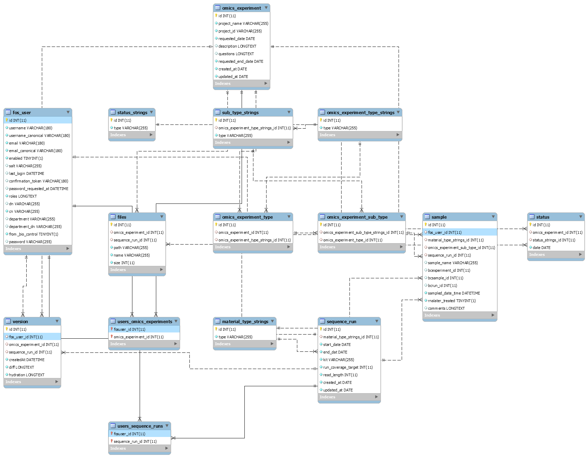

## POEM Component Guide 

This document is intended to be used to help come to grips with the POEM system from a development perspective. It is 
organised in the same layout as the file structure.

### Index

- [app](#app)
  - [config](#config)
  - [Resources](#resources) 
- [AppBundle](#appbundle)
  - [BioControl](#biocontrol)
  - [Command](#command)
  - [Controller](#controller)
  - [DataFixtures](#datafixtures)
    - [Data](#data)
    - [Real](#real)
    - [Test](#test)
  - [Entity](#entity)
  - [EventListener](#eventlistener)
  - [Form](#form)
  - [Repository](#repository)
  - [Resources](#resources)
  - [Twig](#twig)
  - [Uploader](#uploader)
  - [UserManager](#usermanager)
  - [Version Manager](#versionmanager) 
- [tests/AppBundle](#tests/appbundle)
  - [Controller](#controller)
  
## app

Inside the main `app` directory is `AppKernal.php`, which must be modified if adding new bundles by extending the 
`registerBundles` internal array. 

### config

- `config.yml` contains a huge amount of configuration information for all the services and bundles inside the application.
The `config_*.yml` contain overriding information for different environments. When adding new CSS or JS files, the Assetic 
config must be modified in this file to include them.
- `parameters.yml` is a `.gitignore` file that contains sensitive information for the operation of POEM. `parameters.yml.dist` 
provides a composer template. 
- `security.yml` contains the config for the security portion of POEM. This includes defining access roles as well as 
access control for various urls in POEM. 
- `services.yml` registers custom services (such as the file uploader and version manager), and gives them various other 
container components. If custom classes are created, they should often be registered in this way for use throughout POEM. 

### Resources

The resources folder contains all the `Twig` views for POEM. The `FOSUserBundle` has its own section, which can be modified 
for custom security views.

For POEM, views are broken down into its two main components, OmicsExperiment and SequenceRun. Both components have the 
same views. There are two sections which require additional explanation:
- `/datatables` is a folder containing custom rendering for individual cells of the datatable. Inside the respective 
controller, there is a `datatable` function which defines which file is used for which field. These templates are passed 
two parameters: `dt_item` is the value of the field defined by the function, and `dt_object` is the entire entity of that 
datatable row. 
- `*_subfields.html.twig` is a file containing the prototype templates used for the nested forms. These are used when items 
are added dynamically to the form. 

## AppBundle

### BioControl

The `BioControlManager` class is used to convert JSON data from the OmicsExperiment Sample form, into Microsoft SQL 
queries which interface with the BioControl server, and then converting the results back into JSON for use in the frontend.

There is an additional method (`getBioControlSampleNonJSON`) which can be used to interact with the server while avoiding 
the JSON overhead.   

### Command

`CreateUsersCommand` and `UpdateUserDnCommand` define console commands for use when interacting with the LDAP server. 
They have been defined in the main ReadMe, and are there so that changes to the LDAP server (say DN changes) can be 
quickly propagated to POEM.   

### Controller

The controllers in POEM are broken down in the OmicsExperiment/SequenceRun controllers, and the BioControl controller. 

All controllers use the annotation notation for routing. 

The OmicsExperiment and SequenceRun controllers have the same methods: Index (which uses the GridAction), New, Show, 
Edit, and Delete. The only notable behavioural change is that the entities have to be persisted and flushed twice: once 
for associations to form, and a second time for versioning to occur. OmicsExperiment also has an `ExportAction` which is 
used to produce CSV output of the entity.  

The BioControl controller is an AJAX action for interfacing with the [`BioControlManager`](#biocontrol).

### DataFixtures

Fixtures are used in POEM both for testing, and for initialising the production and development databases.

For development and production enviroments, initial loading is as follows:

```
sudo php bin/console doctrine:fixtures:load --fixtures=src/AppBundle/DataFixtures/ORM/Real --fixtures=src/AppBundle/DataFixtures/ORM/Data
```

#### Data

The data fixture is for loading preexisting Omics Experiments from their old Excel format into the system. It should be 
run every time the database is created. It uses the `LoadExcelData` class, which is fairly sensitive to the excel 
structure and would need to be modified should that change. 

Additionally, the class requires the following two parameters: `excel_data_path`, and `excel_data_worksheet`.

#### Real

This set of fixtures is for loading users from the LDAP server, the strings for StatusStrings and MaterialTypeStrings, 
and also the relationships between OmicsExperimentType and OmicsExperimentSubType. These are all required for operation 
of POEM, and this folder must be loaded into the database for it work.  

#### Test

This set of fixtures loads some very simple data into the database for testing. It is used by the testing suite, and can 
also be loaded seperately for adhoc inspections and testing. 

### Entity

These files define the entity structures for database objects via Doctrine. They use the annotation notation, and changes 
to them can be propagated using the following console command:

```
sudo php bin/console doctrine:schema:update --force
```

The EER diagram for all entities is as follows:



### EventListener

The `EntityListener` class is used to watch for changes to Doctrine entities, more specifically, it watches for changes 
involving the File entity, and calls the [`FileUploader`](#uploader) methods as needed.

This could have been directly inside the entities themselves, but it is better practice and cleaner to move the listener 
to a separate file. 

### Form
### Repository
### Resources
### Twig
### Uploader
### UserManager 
### Version Manager 

## tests/AppBundle

### Controller